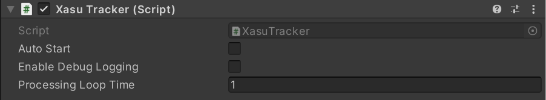

<!-- TODO: Update -->

## Installation
Xasu requires at least **Unity 2019.4 (LTS)**.

Xasu can be downloaded through the Unity Package Manager using the [repository link](https://github.com/e-ucm/xasu.git) of this project.

To add it to your proyect:
* Go to ``Window > Package Manager``
* Press the "+" icon.
* Select ``Add package from git...``.
* Insert ```https://github.com/e-ucm/xasu.git``` 
* Press "Add".

If you want to manually include Xasu into your project (for example, by downloading the repository as a .zip), make sure you install also the NewtonSoft.JSON library using the Unity Package Manager.

## Configuration file

The tracker configuration can be provided either using the `StreamingAssets` folder (recommended) or via scripting. We recommend using the `StreamingAssets` folder to allow configuration to be changed after the game is exported, allowing simpler adaptation of the game to different scenarios without having to recompila the whole game. It must be placed in:

```path
Assets/StreamingAssets/tracker_config.json
```

To check the minimal tracker configuration, check the main [README file](../README.md#minimal-tracker_configjson).

## Adding Xasu to your game

Once Xasu is installed, to add Xasu to your game you just have to create a new GameObject in Unity and include the Xasu component.

If you want to know more about how Xasu works, please check the Wiki:
* Working with Xasu: https://github.com/e-ucm/xasu/wiki/Working-with-Xasu

### Initializing Xasu

When Xasu is added to your scene it won't initialize and connect by default. 

To initialize it automatically, please check the "Auto Start" property in the object inspector.
You can also check "Enable Debug Log" to display debug logs in Unity console.



You can also initialize Xasu manually by using the ```Init``` method:
```cs
    await Xasu.Instance.Init();
```

If you want to learn more about how to initialize Xasu please visit our Wiki.
* Initializing Xasu: https://github.com/e-ucm/xasu/wiki/Working-with-Xasu#initialization
